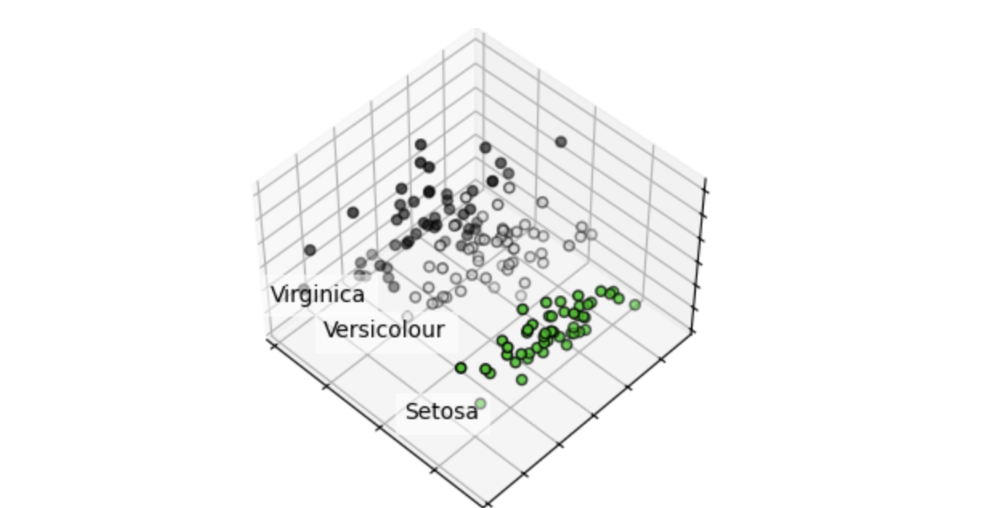

## 학습 표본
### Classification

[](https://scikit-learn.org/stable/auto_examples/classification/plot_classifier_comparison.html)

분류를 위한 표본

> [!NOTE]
> 구매 할지 말지

### Regresssion

[](https://scikit-learn.org/stable/auto_examples/ensemble/plot_adaboost_regression.html)

회기 위한 표본

> [!NOTE]
> 재고량 및 판매량을 유츄

### Clustering
[](https://scikit-learn.org/stable/auto_examples/cluster/plot_kmeans_digits.html)

군집 표본

### Dimensionality
[](https://scikit-learn.org/stable/modules/decomposition.html#decompositions)

군집 차원 표본

## 학습 방법

## Supervised learning (지도학습)
정답이 있는 데이터

```python
clf = RandomForestClassifier()
clf.fit(x_train, y_train)

y_pred = clf.predict(X_test)
clf.score(X_test, y_test)
```
## Unsupervised learning (비지도학습)
정답이 없는 데이터

```python
pca = PCA()
pca.fit(X_train)
X_new = pca.tranfrom(X_test)
```

# 모델

## linear svm
선으로 분류하는 모델

## kernel svm
곡선으로 분류하는 모델

## decision trees
2분법 식으로 나누는 모델

# random forests
decision trees를 여러개 만들어 합치는 모델

# validation curves

# 파라미터
## grid search
일정한 값을 가져옴

## randomized search
랜덤한 값을 가져옴

# 스코어
> [!NOTE]
> 점수를 내는 것

## accuracy
classification 

## r2
refression 용

# 용어

fit : 학습?

fold : 파라미터를 찾기위해 학습데이터를 나누는 것

overfitting and Underfitting : 너무 특이 케이스만 학습을 한 경우

